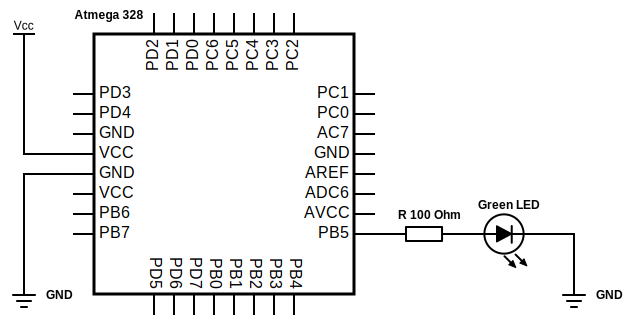

# Lab 1: Pavlo Shelemba

My `Digital-electronics-2` GitHub repository:

https://github.com/xshele01/Digital-electronics-2


### Blink example

1. C programming language contains following binary operators:
   * `|` - bitwise OR
   * `&` - bitwise AND
   * `^` - bitwise XOR
   * `~` - bitwise NOT
   * `<<` - left shift
   * `>>` - right shift

2. Truth table for operators `|`, `&`, `^`, `~`:

| **b** | **a** |**b or a** | **b and a** | **b xor a** | **not b** |
| :-: | :-: | :-: | :-: | :-: | :-: |
| 0 | 0 | 0 | 0 | 0 | 1 |
| 0 | 1 | 1 | 0 | 1 | 1 |
| 1 | 0 | 1 | 0 | 1 | 0 |
| 1 | 1 | 1 | 1 | 0 | 0 |


### Morse code

1. Listing of C code with syntax highlighting which repeats one "dot" and one "comma" (letter `A`) on a LED:

```c
int main(void)
{
    // Set pin as output in Data Direction Register (LED on)
    // DDRB = DDRB or 0010 0000
    DDRB = DDRB | (1<<LED_GREEN);

    // Set pin LOW in Data Register (LED off)
    // PORTB = PORTB and 1101 1111
    PORTB = PORTB & ~(1<<LED_GREEN);

    // Infinite loop
    while (1)
    {
        // Pause several milliseconds
        _delay_ms(SHORT_DELAY);

        // Dot
        DDRB = DDRB | (1<<LED_GREEN);

        _delay_ms(SHORT_DELAY);
        _delay_ms(SHORT_DELAY);

        PORTB = PORTB & ~(1<<LED_GREEN); 

        _delay_ms(SHORT_DELAY);

        // Comma
        DDRB = DDRB | (1<<LED_GREEN);

        _delay_ms(SHORT_DELAY);
        _delay_ms(SHORT_DELAY);
        _delay_ms(SHORT_DELAY);
        _delay_ms(SHORT_DELAY);

        PORTB = PORTB & ~(1<<LED_GREEN);
    }

    // Will never reach this
    return 0;
}
```

2. Scheme of Morse code application (connection of AVR device, LED, resistor, and supply voltage):

   
