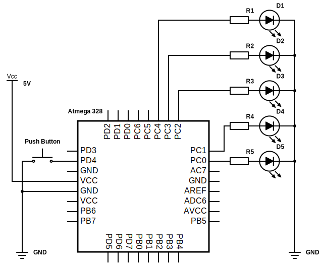

# Lab 2: Pavlo Shemenba

Link to my `Digital-electronics-2` GitHub repository:

https://github.com/xshele01/Digital-electronics-2


## Active-low and active-high LEDs

1. According to the AVR manual:

    | **DDRB** | **Description** |
    | :-: | :-- |
    | 0 | Input pin |
    | 1 | Output pin |

    | **PORTB** | **Description** |
    | :-: | :-- |
    | 0 | Output LOW value |
    | 1 | Output HIGH value |

    | **DDRB** | **PORTB** | **Direction** | **Internal pull-up resistor** | **Description** |
    | :-: | :-: | :-: | :-: | :-- |
    | 0 | 0 | input | no | Tri-state, high-impedance |
    | 0 | 1 | input | yes  | Pxn will source current if ext. pulled low |
    | 1 | 0 | output | no | Output Low (Sink) |
    | 1 | 1 | output | no | Output High (Source) |

1. Part of the C code, which blinks alternately with a pair of LEDs; one LED is connected to port B and the other to port C:

```c
int main(void)
{
    // Green LED at port B
    // Set pin as output in Data Direction Register...
    DDRB = DDRB | (1<<LED_GREEN);
    // ...and turn LED off in Data Register
    PORTB = PORTB & ~(1<<LED_GREEN);

    // Configure the second LED at port C
    // Set pin as output in Data Direction Register...
    DDRC = DDRC | (1<<LED_BREADBOAD);
    // ...and turn LED off in Data Register
    PORTC = PORTC & ~(1<<LED_BREADBOAD);

    // Infinite loop
    while (1)
    {
        // Pause several milliseconds
        _delay_ms(BLINK_DELAY);
        
        PORTB = PORTB ^ (1<<LED_GREEN);
        PORTC = PORTC ^ (1<<LED_BREADBOAD); 
    }

    // Will never reach this
    return 0;
}
```


## Push button

Part of the C code, wich toggles LEDs when a push button is pressed. Otherwise, the values of the LEDs do not change. The button is connected to port D:

```c
// Configure Push button at port D and enable internal pull-up resistor
DDRD = DDRD & ~(1<<PUSH_BREADBOAD);
PORTD = PORTD | (1<<PUSH_BREADBOAD);

// Infinite loop
while (1)
{
    // Pause several milliseconds
    _delay_ms(BLINK_DELAY);

    if(bit_is_clear(PIND, PUSH_BREADBOAD))
    {
        PORTB = PORTB ^ (1<<LED_GREEN);
        PORTC = PORTC ^ (1<<LED_BREADBOAD);
        loop_until_bit_is_set(PIND, PUSH_BREADBOAD);
    }
}
```


## Knight Rider

Scheme of Knight Rider application (connection of AVR device, LEDs, resistors, push button and supply voltage):

