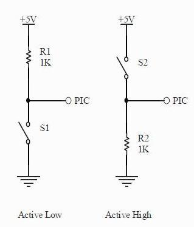

# Lab 2: Control of GPIO, LED, push button

### Part 1: Preparation tasks

1. Two basic ways to connect the LED to the output pin of the microcontroller: 
   
    

2. The LED resistor values for typical red and blue LEDs can be calculated according to Ohm's law:

    

    | **LED color** | **Supply voltage** | **LED current** | **LED voltage** | **Resistor value** |
    | :-: | :-: | :-: | :-: | :-: |
    | red | 5&nbsp;V | 20&nbsp;mA | 2&nbsp;V | 150&nbsp;Ω |
    | green | 5&nbsp;V | 20&nbsp;mA | 2.2&nbsp;V | 140&nbsp;Ω |
    | blue | 5&nbsp;V | 20&nbsp;mA | 3.3&nbsp;V | 85&nbsp;Ω |

3. Two basic ways to connect a push button to the microcontroller input pin:

    

### Part 2: Active-low and active-high LEDs

1. According to the AVR manual:

    | **DDRB** | **Description** |
    | :-: | :-- |
    | 0 | Input pin |
    | 1 | Output pin |

    | **PORTB** | **Description** |
    | :-: | :-- |
    | 0 | Output LOW value |
    | 1 | Output HIGH value|

    | **DDRB** | **PORTB** | **Direction** | **Internal pull-up resistor** | **Description** |
    | :-: | :-: | :-: | :-: | :-- |
    | 0 | 0 | input | no | Tri-state, high-impedance |
    | 0 | 1 | input | yes  | Pxn will source current if ext. pulled low |
    | 1 | 0 | output | no | Output Low (Sink) |
    | 1 | 1 | output | no | Output High (Source) |

    | **Port** | **Pin** | **Input/output usage?** |
    | :-: | :-: | :-: |
    | A | x | Microcontroller ATmega328P does not contain port A | 
    | B | 0 | Pin 8 |
    |  | 1 | Pin ~9 |
    |  | 2 | Pin ~10 |
    |  | 3 | Pin ~11 | 
    |  | 4 | Pin 12 |
    |  | 5 | Pin 13 |
    |  | 6 |  - |
    |  | 7 |  - | 
    | C | 0 | Pin A0 |
    |  | 1 | Pin A1 |
    |  | 2 | Pin A2 |
    |  | 3 | Pin A3 | 
    |  | 4 | Pin A4 |
    |  | 5 | Pin A5 |
    |  | 6 |  - |
    |  | 7 |  - | 
    | D | 0 | Pin RX<-0 |
    |  | 1 | Pin TX->1 |
    |  | 2 | Pin 2 |
    |  | 3 | Pin ~3 |
    |  | 4 | Pin 4 |
    |  | 5 | Pin ~5 |
    |  | 6 | Pin ~6 |
    |  | 7 | Pin 7 |
