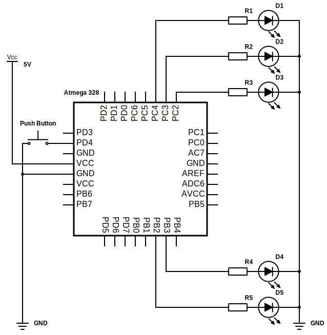

# Lab 3: Pavlo Shelemba

Link to my `Digital-electronics-2` GitHub repository:

https://github.com/xshele01/Digital-electronics-2


### Data types in C

| **Data type** | **Number of bits** | **Range** | **Description** |
| :-: | :-: | :-: | :-- | 
| `uint8_t`  | 8 | 0 to 255 | Unsigned 8-bit integer |
| `int8_t`   | 8 | -128 to 127 | Signed 8-bit integer |
| `uint16_t` | 16 | 0 to 65,535 | Unsigned 16-bit integer |
| `int16_t`  | 16 | -32,768 to 32,767 | Signed 16-bit integer |
| `float`    | 32 | -3.4e+38 to 3.4e+38 | Single-precision floating-point |
| `void`     | - | - | No type |


### GPIO library

1. Difference between function declaration and definition in C:
   * **Function declaration** tells the compiler about the existence of a function.
   * **Function definition** actually implements a function.

2. Part of the C code, which uses my GPIO library to toggle LEDs when a push button is pressed. Otherwise, the values of the LEDs do not change. The button is connected to port D:

    ```c
    // Configure Push button at port D and enable internal pull-up resistor
    GPIO_config_input_pullup(&DDRD, PUSH_BTN);

    // Infinite loop
    while (1)
    {
        if (!GPIO_read(&PIND, PUSH_BTN))
        {
            GPIO_toggle(&PORTB, LED_GREEN);
            GPIO_toggle(&PORTC, LED_BREAD);
            
            while (!GPIO_read(&PIND, PUSH_BTN))
                continue;
        }
    }
    ```
 

### Traffic light

Scheme of traffic light application (connection of AVR device, LEDs, resistors, push button and supply voltage):



| **Component** | **Description** |
| :-: | :-: |
| D1, D4  | Red LEDs |
| D2   | Yellow LED |
| D3, D4 | Green LEDs |
| R1-R5  | Current limiting resistors |