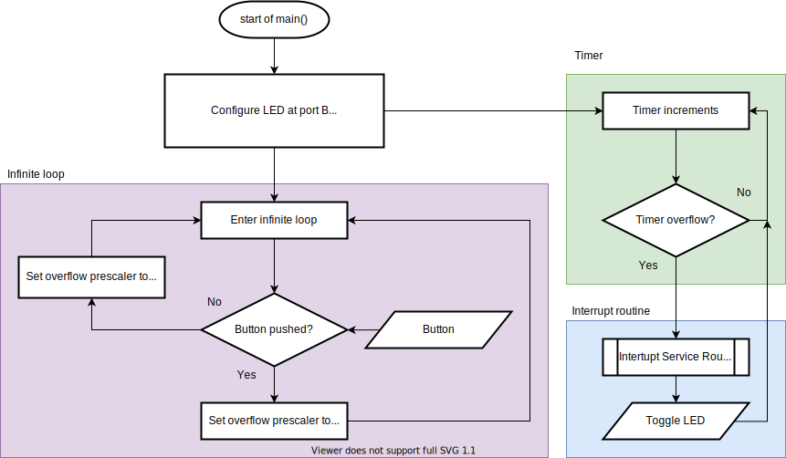
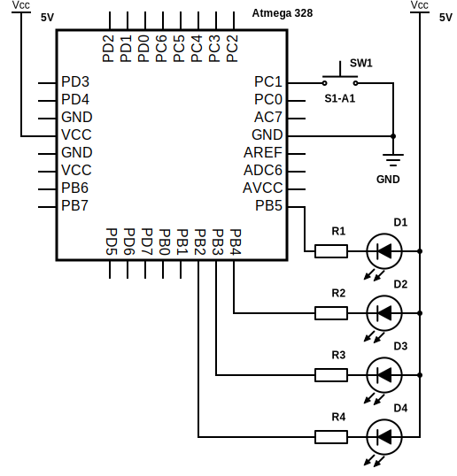

# Lab 4: Pavlo Shelemba

Link to my `Digital-electronics-2` GitHub repository:

https://github.com/xshele01/Digital-electronics-2


### Overflow times

Overflow times in seconds for three Timer/Counter modules that contain ATmega328P if CPU clock frequency is 16 MHz:

| **Module** | **Number of bits** | **1** | **8** | **32** | **64** | **128** | **256** | **1024** |
| :-: | :-: | :-: | :-: | :-: | :-: | :-: | :-: | :-: |
| Timer/Counter0 | 8  | 16u | 128u | -- | 1024u | -- | 4128u | 16384u |
| Timer/Counter1 | 16 | 4096u | 32768u | -- | 262144u | -- | 1056768u | 4194304u |
| Timer/Counter2 | 8  | 16u | 128u | 512u | 1024u | 2048u | 4128u | 16384u |


### Timer library

1. In your words, describe the difference between common C function and interrupt service routine.
   * **Function** is a reusable sequence of statements that is invoked by a function call. Upon execution, current function is interrupted and instuctions inside a called function are executed. After completion program returns back to the point right after the function call. 
   * **Interrupt** is a spetial condition, that is initiated by an internal or external signal. It results in execution of *Interrupt Service Routine*, which suspends execution of a program and carries out a special set of instructions. Upon completion the program is resumed.

2. Part of the header file listing with syntax highlighting, which defines settings for Timer/Counter0:

   ```c
   /**
    * @name  Definitions of Timer/Counter0
    * @note  F_CPU = 16 MHz
    */
   /** @brief Stop timer, prescaler 000 --> STOP */
   #define TIM0_stop()           TCCR0B &= ~((1<<CS02) | (1<<CS01) | (1<<CS00));
   /** @brief Set overflow 4ms, prescaler 001 --> 1 */
   #define TIM0_overflow_4ms()   TCCR0B &= ~((1<<CS02) | (1<<CS01)); TCCR0B |= (1<<CS00);
   /** @brief Set overflow 33ms, prescaler 010 --> 8 */
   #define TIM0_overflow_33ms()  TCCR0B &= ~((1<<CS02) | (1<<CS00)); TCCR0B |= (1<<CS01);
   /** @brief Set overflow 262ms, prescaler 011 --> 64 */
   #define TIM0_overflow_262ms() TCCR0B &= ~(1<<CS02); TCCR0B |= (1<<CS01) | (1<<CS00);
   /** @brief Set overflow 1s, prescaler 100 --> 256 */
   #define TIM0_overflow_1s()    TCCR0B &= ~((1<<CS01) | (1<<CS00)); TCCR0B |= (1<<CS02);
   /** @brief Set overflow 4s, prescaler // 101 --> 1024 */
   #define TIM0_overflow_4s()    TCCR0B &= ~(1<<CS01); TCCR0B |= (1<<CS02) | (1<<CS00);
   /** @brief Enable overflow interrupt, 1 --> enable */
   #define TIM0_overflow_interrupt_enable()  TIMSK0 |= (1<<TOIE0);
   /** @brief Disable overflow interrupt, 0 --> disable */
   #define TIM0_overflow_interrupt_disable() TIMSK0 &= ~(1<<TOIE0);
   ```

3. Flowchart figure for function `main()` and interrupt service routine `ISR(TIMER1_OVF_vect)` of application that ensures the flashing of one LED in the timer interruption. When the button is pressed, the blinking is faster, when the button is released, it is slower:

   


### Knight Rider

Scheme of Knight Rider application with four LEDs and a push button, connected according to [Multi-function shield](../../Docs/arduino_shield.pdf):


