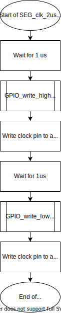
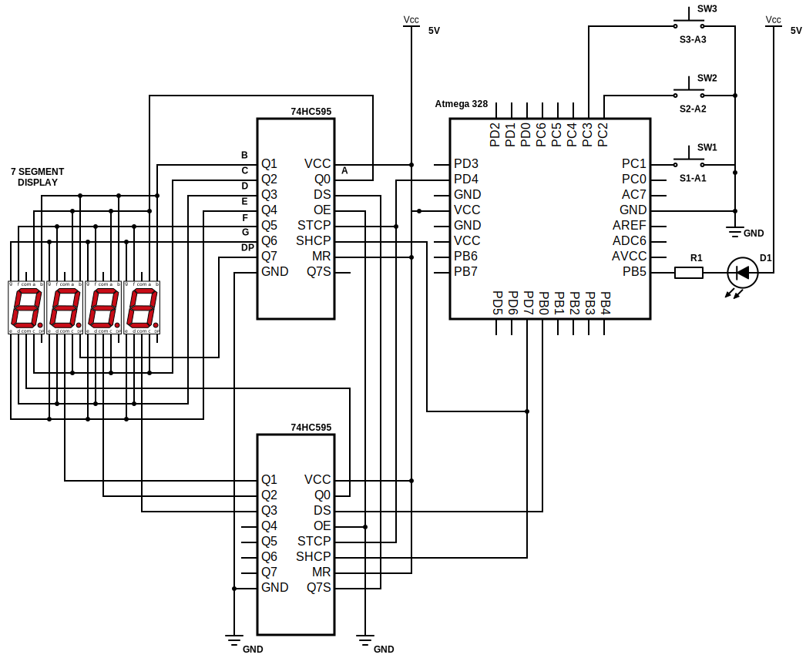

# Lab 5: Pavlo Shelemba

Link to my `Digital-electronics-2` GitHub repository:

https://github.com/xshele01/Digital-electronics-2

### 7-segment library

1. Difference between Common Cathode and Common Anode 7-segment display:
   * Common Cathode 7-segment display (CC SSD) has all the cathodes of the 7-segments connected directly together to logic LOW or ground. The individual segments are illuminated by application of a HIGH signal via a current limiting resistor to forward bias the individual Anode terminals.
   * Common Anode 7-segment display (CA SSD) has all the anodes of the 7-segments connected together to logic HIGH. The individual segments are illuminated by applying a ground, logic LOW signal via a suitable current limiting resistor to the Cathode of the particular segment.

2. Code listing with syntax highlighting of two interrupt service routines (`TIMER1_OVF_vect`, `TIMER0_OVF_vect`) from counter application with at least two digits, ie. values from 00 to 59:

```c
/**********************************************************************
 * Function: Timer/Counter1 overflow interrupt
 * Purpose:  Increment counter value from 00 to 59.
 **********************************************************************/
ISR(TIMER1_OVF_vect)
{
    ++count_0;
    
    if (count_0 == 10)
    {
        count_0 = 0;
        ++count_1;
        
        if (count_1 == 6)
        {
            count_0 = 0;
            count_1 = 0;
        }
    }
}
```

```c
/**********************************************************************
 * Function: Timer/Counter0 overflow interrupt
 * Purpose:  Display tens and units of a counter at SSD.
 **********************************************************************/
ISR(TIMER0_OVF_vect)
{
    static uint8_t pos = 0;
    
    switch(pos)
    {
        case 0:
            SEG_update_shift_regs(count_0, pos++);
            break;
        case 1:
            SEG_update_shift_regs(count_1, pos);
            pos = 0;
            break;
    }
}
```

1. Flowchart figure for function `SEG_clk_2us()` which generates one clock period on `SEG_CLK` pin with a duration of 2 us:



### Kitchen alarm

A kitchen alarm with a 7-segment display, one LED and three push buttons: start, +1 minute, -1 minute. +1/-1 minute buttons are used to increment/decrement the timer value. After pressing the Start button, the countdown starts. The countdown value is shown on the display in the form of mm.ss (minutes.seconds). At the end of the countdown, the LED starts blinking.

1. Schematic of kitchen alarm:


