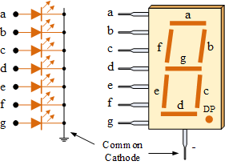
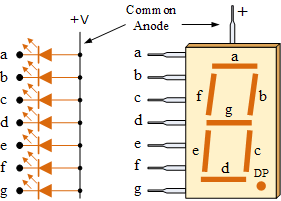

1. According to [7-segment display tutorial](https://www.electronics-tutorials.ws/blog/7-segment-display-tutorial.html), the displays common pin is generally used to identify the type of 7-segment display:
   * Common Cathode 7-segment display (CC SSD) has all the cathodes of the 7-segments connected directly together to logic LOW or ground. The individual segments are illuminated by application of a HIGH signal via a current limiting resistor to forward bias the individual Anode terminals.
  
   * Common Anode 7-segment display (CA SSD) has all the anodes of the 7-segments connected together to logic HIGH. The individual segments are illuminated by applying a ground, logic LOW signal via a suitable current limiting resistor to the Cathode of the particular segment.
 

2. Binary values of the segments for display 0 to 9 on a common anode 7-segment display:

   | **Digit** | **A** | **B** | **C** | **D** | **E** | **F** | **G** | **DP** |
   | :-: | :-: | :-: | :-: | :-: | :-: | :-: | :-: | :-: |
   | 0 | 0 | 0 | 0 | 0 | 0 | 0 | 1 | 1 |
   | 1 | 1 | 0 | 0 | 1 | 1 | 1 | 1 | 1 |
   | 2 | 0 | 0 | 1 | 0 | 0 | 1 | 0 | 1 |
   | 3 | 0 | 0 | 0 | 0 | 1 | 1 | 0 | 1 |
   | 4 | 1 | 0 | 0 | 1 | 1 | 0 | 0 | 1 |
   | 5 | 0 | 1 | 0 | 0 | 1 | 0 | 0 | 1 |
   | 6 | 0 | 1 | 0 | 0 | 0 | 0 | 0 | 1 |
   | 7 | 0 | 0 | 0 | 1 | 1 | 1 | 1 | 1 |
   | 8 | 0 | 0 | 0 | 0 | 0 | 0 | 0 | 1 |
   | 9 | 0 | 0 | 0 | 1 | 1 | 0 | 0 | 1 |

3. According to the scematic of [Multi-function shield](../../Docs/arduino_shield.pdf), seven-segment display has a common anode (active LOW) connection. 

    Two 74HC595 shift registers allow a gradual (serial) insertion of individual bits into the shift register by means of a clock signal. With each CLK period, one bit is "pushed"; 8 periods are required to display one symbol.