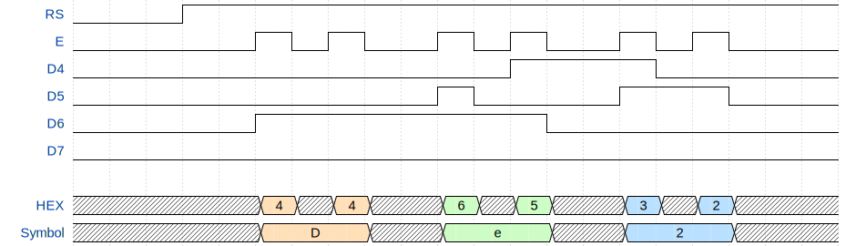
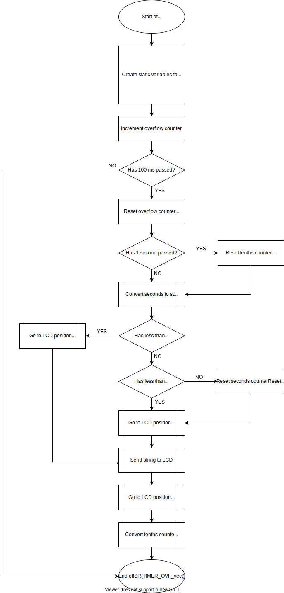

# Lab 6: Pavlo Shelemba

Link to my `Digital-electronics-2` GitHub repository:

https://github.com/xshele01/Digital-electronics-2


### LCD display module

1. ASCII table contains 7-bit character codes where every single bit represents a unique character.  

2. Picture of time signals between ATmega328P and LCD keypad shield (HD44780 driver) when transmitting three character data `De2`:




### Stopwatch

1. Flowchart figure for `TIMER2_OVF_vect` interrupt service routine which overflows every 16&nbsp;ms but it updates the stopwatch LCD approximately every 100&nbsp;ms (6 x 16&nbsp;ms = 100&nbsp;ms). Displays tenths of a second and seconds `00:seconds.tenths`. Stopwatch counts from `00:00.0` to `00:59.9` and then starts again:




### Custom characters

1. Code listing of two custom character definitions:

```c
/* Variables ---------------------------------------------------------*/
// Custom character definitions for progress bar
uint8_t loadChar2[8] = {
    0b11000,
    0b11000,
    0b11000,
    0b11000,
    0b11000,
    0b11000,
    0b11000,
    0b11000
};

uint8_t loadChar3[8] = {
    0b11100,
    0b11100,
    0b11100,
    0b11100,
    0b11100,
    0b11100,
    0b11100,
    0b11100
};
```


### Kitchen alarm

A kitchen alarm with an LCD, one LED and three push buttons: start, +1 minute, -1 minute. 
+1/-1 minute buttons are used to increment/decrement the timer value. After pressing the Start button, the countdown starts. 
The countdown value is shown on the display in the form of mm.ss (minutes.seconds). 
At the end of the countdown, the LED will start blinking.

1. Schematic of kitchen alarm:


