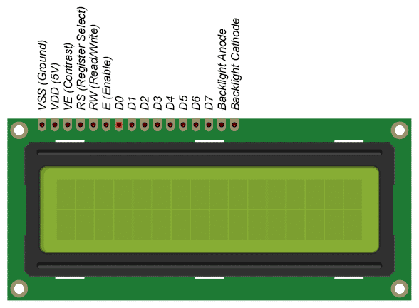

# Lab 6: Display devices, LCD display

### Preparation tasks 

1. According to the schematic of the [LCD keypad shield](../../Docs/arduino_shield.pdf):

   

   **GND** should be connected to the ground of Arduino.

   **VCC** is the power supply for the LCD which we connect the 5 volts pin on the Arduino.

   **VE** (LCD Contrast) controls the contrast and brightness of the LCD. Using a simple voltage divider with a potentiometer, we can make fine adjustments to the contrast.

   **RS** (Register Select) pin lets the Arduino tell the LCD whether it is sending commands or the data. Basically this pin is used to differentiate commands from the data.
   When a command is given on the LCD, we select the command register (RS = 0) and when data is sent to the LCD for display, we select the data register (RS = 1). A command is an instruction entered on the LCD in order to perform the required function. In order to display textual information, data is send to LCD.

   **R/W** (Read/Write) pin on the LCD is to control whether or not you’re reading data from the LCD or writing data to the LCD. Since we’re just using this LCD as an OUTPUT device, we’re going to tie this pin LOW.

   **E** (Enable) pin is used to enable the display. When this pin is set to LOW, the LCD does not care what is happening with R/W, RS, and the data bus lines; when this pin is set to HIGH, the LCD is processing the incoming data.

   **D0-D7** (Data Bus) are the pins that carries the 8 bit data we send to the display. For example, if we want to see the uppercase ‘A’ character on the display we will set these pins to 0100 0001(according to the ASCII table) to the LCD.

   **A-K** (Anode & Cathode) pins are used to control the backlight of the LCD.

   | **LCD signal(s)** | **AVR pin(s)** | **Description** |
   | :-: | :-: | :-- |
   | RS | PB0 | Register selection signal. Selection between Instruction register (RS=0) and Data register (RS=1) |
   | R/W | GND | Read/Write signal. Permanently connected to GND |
   | E | PB1 | Enable signal |
   | D[3:0] | - | Disconected |
   | D[7:4] | PD[7:4] | Four data lines to send commands and data to the LSD |

2. ASCII stands for American Standard Code for Information Interchange. Computers can only understand numbers, so an ASCII code is the numerical representation of a character such as 'a' or '@' or an action of some sort.

   Below is the ASCII character table and this includes descriptions for uppercase letters `A` to `Z`, lowercase letters `a` to `z`, and numbers `0` to `9`:

   | **Char** | **Decimal** | **Hexadecimal** | **Char** | **Decimal** | **Hexadecimal** |
   | :-: | :-: | :-: | :-: | :-: | :-: |
   | `A` | 65 | 0x41 | `a` | 97 | 0x61 |
   | `B` | 66 | 0x42 | `b` | 98 | 0x62 |
   | `C` | 67 | 0x43 | `c` | 99 | 0x63 |
   | `D` | 68 | 0x44 | `d` | 100 | 0x64 |
   | `E` | 69 | 0x45 | `e` | 101 | 0x65|
   | `F` | 70 | 0x46 | `f` | 102 | 0x66 |
   | `G` | 71 | 0x47 | `g` | 103 | 0x67 |
   | `H` | 72 | 0x48 | `h` | 104 | 0x68 |
   | `I` | 73 | 0x49 | `i` | 105 | 0x69 |
   | `J` | 74 | 0x4A | `j` | 106 | 0x6A |
   | `K` | 75 | 0x4B | `k` | 107 | 0x6B |
   | `L` | 76 | 0x4C | `l` | 108 | 0x6C |
   | `M` | 77 | 0x4D | `m` | 109 | 0x6D |
   | `N` | 78 | 0x4E | `n` | 110 | 0x6E |
   | `O` | 79 | 0x4F | `o` | 111 | 0x6F |
   | `P` | 80 | 0x50 | `p` | 112 | 0x70 |
   | `Q` | 81 | 0x51 | `q` | 113 | 0x71 |
   | `R` | 82 | 0x52 | `r` | 114 | 0x72 |
   | `S` | 83 | 0x53 | `s` | 115 | 0x73 |
   | `T` | 84 | 0x54 | `t` | 116 | 0x74 |
   | `U` | 85 | 0x55 | `u` | 117 | 0x75 |
   | `V` | 86 | 0x56 | `v` | 118 | 0x76 |
   | `W` | 87 | 0x57 | `w` | 119 | 0x77 |
   | `X` | 88 | 0x58 | `x` | 120 | 0x78 |
   | `Y` | 89 | 0x59 | `y` | 121 | 0x79 |
   | `Z` | 90 | 0x5A | `z` | 122 | 0x7A |

   | **Char** | **Decimal** | **Hexadecimal** |
   | :-: | :-: | :-: |
   | `0` | 48 | 0x30 |
   | `1` | 49 | 0x31 |
   | `2` | 50 | 0x32 |
   | `3` | 51 | 0x33 |
   | `4` | 52 | 0x34 
   | `5` | 53 | 0x35 |
   | `6` | 54 | 0x36 |
   | `7` | 55 | 0x37 |
   | `8` | 56 | 0x38 |
   | `9` | 57 | 0x39 |

### Part 3: Library for HD44780 based LCDs

According to [online manual of LCD library](http://www.peterfleury.epizy.com/doxygen/avr-gcc-libraries/group__pfleury__lcd.html) by Peter Fleury:

| **Function name** | **Function parameters** | **Description** | **Example** |
| :-- | :-- | :-- | :-- |
| `lcd_init` | `LCD_DISP_OFF` `LCD_DISP_ON` `LCD_DISP_ON_CURSOR` `LCD_DISP_ON_CURSOR_BLINK` | Display off Display on, cursor off Display on, cursor on Display on, cursor on flashing | `lcd_init(LCD_DISP_OFF);` `lcd_init(LCD_DISP_ON);` `lcd_init(LCD_DISP_ON_CURSOR);` `lcd_init(LCD_DISP_ON_CURSOR_BLINK);` |
| `lcd_clrscr` | `void` | Clear display and set cursor to home position | `lcd_clrscr();` |
| `lcd_gotoxy` | `uint8_t x`  `uint8_t y`   | Display character at current cursor position | `lcd_gotoxy(0, 0);` |
| `lcd_putc` | `char c` | Character to be displayed | `lcd_putc('C');` |
| `lcd_puts` | `const char * s` | Display string without auto linefeed |   `lcd_puts('Hello World');` |
| `lcd_command` |  `uint8_t cmd` | Send LCD controller instruction command | |
| `lcd_data` | `uint8_t data` | Send data byte to LCD controller | |
