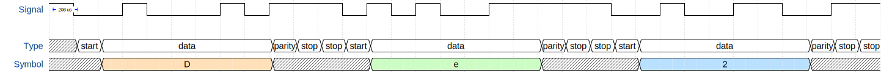
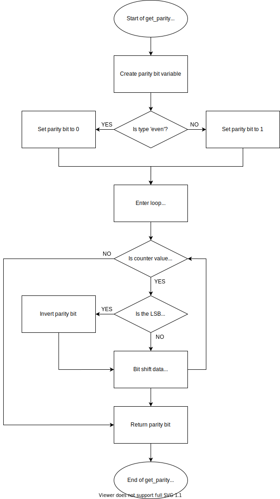

# Lab 7: Pavlo Shelemba

Link to my `Digital-electronics-2` GitHub repository:

https://github.com/xshele01/Digital-electronics-2


### Analog-to-Digital Conversion

1. Complete table with voltage divider, calculated, and measured ADC values for all five push buttons:

   | **Push button** | **PC0[A0] voltage** | **ADC value (calculated)** | **ADC value (measured)** |
   | :-- | :-: | :-: | :-: |
   | Right  | 0&nbsp;V | 0 | 0 |
   | Up     | 0.496&nbsp;V | 102 | 98 |
   | Down   | 1.203&nbsp;V | 246 | 256 |
   | Left   | 1.907&nbsp;V | 390 | 408 |
   | Select | 3.182&nbsp;V | 651 | 639 |
   | none   | 5&nbsp;V | 1023 | 1023 |

2. Code listing of ACD interrupt service routine for sending data to the LCD/UART and identification of the pressed button:

   ```c
   /**********************************************************************
    * Function: ADC complete interrupt
    * Purpose:  Display value on LCD and send it to UART.
    **********************************************************************/
   ISR(ADC_vect)
   {
      uint16_t value = 0;
      char lcd_string[4] = "0000";

      value = ADC;                  // Copy ADC result to 16-bit variable
      itoa(value, lcd_string, 10);  // Convert decimal value to string

      uart_puts(lcd_string);        // Put string to ringbuffer
      uart_puts("\n\r");

      lcd_gotoxy(8, 0); lcd_puts("    ");       // Clear decimal position
      lcd_gotoxy(8, 0); lcd_puts(lcd_string);   // Put ADC value in decimal
      
      itoa(value, lcd_string, 16);              // Convert hexadecimal value to string
      
      lcd_gotoxy(13,0); lcd_puts("    ");       // Clear hexadecimal position
      lcd_gotoxy(13,0); lcd_puts(lcd_string);   // Put ADC value in hexadecimal
      
      lcd_gotoxy(8, 1); lcd_puts("      ");     // Clear button position
      lcd_gotoxy(8, 1); 
      
      // Decide on a pressed button based on a ADC value
      if (value > 1000)                             
      {
         lcd_puts("none");
      }
      else if (value > 600)
      {
         lcd_puts("select");
      }
      else if (value > 300)
      {
         lcd_puts("left");
      }
      else if (value > 200)
      {
         lcd_puts("down");
      }
      else if (value > 90)
      {
         lcd_puts("up");
      }
      else if (value >= 0)
      {
         lcd_puts("right");
      }
   }
   ```


### UART communication

1. Picture of UART signal when transmitting three character data `De2` in 4800 7O2 mode (7 data bits, odd parity, 2 stop bits, 4800&nbsp;Bd):

   

2. Flowchart figure for function `uint8_t get_parity(uint8_t data, uint8_t type)` which calculates a parity bit of input 8-bit `data` according to parameter `type`:

   


### Temperature meter

An application for temperature measurement and display using temperature sensor [TC1046](../../Docs/21496C.pdf), LCD, one LED and a push button. 
After pressing the button, the temperature is measured, its value is displayed on the LCD and data is sent to the UART. When the temperature is too high, the LED will start blinking.

Schematic:


